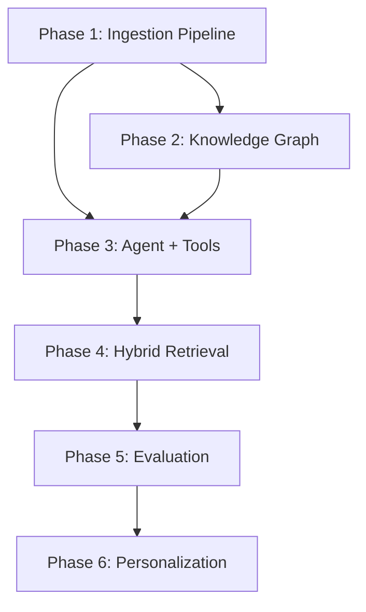

# Agentic News Intelligence System — Project Plan

## 1. Design Review & Critique

### What's Good
- **Async pipeline decoupled from the agent** — correct pattern. Ingestion should never block the user-facing agent.
- **Dual retrieval (vector + graph)** — vector search handles "what happened at X?" while graph traversal handles "what led up to X?" — these are complementary.
- **Future personalization scope** — thinking about user history early is wise since it shapes the data model.

### Flaws & Gaps in the Current Design

| # | Issue | Why It Matters |
|---|-------|---------------|
| 1 | **No deduplication strategy** | Multiple sources will publish the same story. Without dedup, your vector DB fills with near-duplicates and retrieval quality drops. |
| 2 | **No entity extraction step** | You can't build graph edges ("article A continues event X") without first extracting entities (people, orgs, locations, events). GraphRAG depends on this. |
| 3 | **Missing chunking strategy** | Embedding entire articles loses detail. Embedding raw sentences loses context. You need a deliberate chunking approach. |
| 4 | **No freshness / TTL management** | News gets stale. A 6-month-old article about "latest GDP numbers" will poison retrieval unless you decay or expire old embeddings. |
| 5 | **No hybrid retrieval ranking** | Vector search and graph traversal return different score types. You need a fusion/reranking step before feeding context to the LLM. |
| 6 | **Agent has no explicit tool definitions** | Your current agent calls MCP tools, but you haven't designed *which* tools the news agent needs (search, graph query, summarize, etc.). |
| 7 | **No evaluation framework** | Without measuring retrieval quality and answer accuracy, you can't iterate. |
| 8 | **No error handling / retry in pipeline** | News APIs rate-limit. Scrapers fail. Embeddings timeout. The pipeline needs resilience. |
| 9 | **No metadata schema** | Articles need structured metadata (source, timestamp, category, entities, story_cluster_id) for filtering and graph construction. |
| 10 | **Graph relationship types undefined** | "Continuation of previous event" is one relation. But you also need: same_entity, same_topic, contradicts, updates, etc. |

---

## 2. Agentic Concepts You'll Learn

This project is designed so that every major agentic concept is encountered naturally:

| Concept | Where You'll Learn It |
|---------|----------------------|
| **Tool Use / Function Calling** | Agent calling search, graph query, and summarization tools via MCP |
| **RAG (Retrieval Augmented Generation)** | Vector search over article embeddings → context injection → LLM generation |
| **GraphRAG** | Entity-linked knowledge graph for multi-hop event chain retrieval |
| **Memory — Short Term** | Conversation history within a session (you already have this) |
| **Memory — Long Term** | User reading history, preferences stored in Qdrant |
| **Planning / ReAct Loop** | Agent deciding: do I need more context? Should I search or query graph? Is this enough to answer? |
| **Multi-Step Reasoning** | "What led to the current India-Pakistan tension?" requires graph traversal → vector search → synthesis |
| **Async Pipelines** | Background ingestion pipeline running independently of agent |
| **Evaluation & Guardrails** | Measuring retrieval relevance, answer faithfulness, hallucination detection |
| **MCP (Model Context Protocol)** | All tools exposed via MCP server (you already have the foundation) |
| **Orchestration** | Pipeline scheduling, retry logic, backpressure |
| **Personalization** | User profile embeddings, reading history, preference-weighted ranking |

---

## 3. Architecture

```
┌─────────────────────────────────────────────────────────────────────┐
│                        INGESTION PIPELINE (Async)                   │
│                                                                     │
│  ┌──────────┐    ┌──────────────┐    ┌────────────┐    ┌─────────┐ │
│  │  News API │───▸│  Fetch &     │───▸│  NLP /     │───▸│  Store  │ │
│  │  Sources  │    │  Dedup       │    │  Extract   │    │         │ │
│  └──────────┘    └──────────────┘    └────────────┘    │ Vector  │ │
│                                                         │ + Graph │ │
│  RSS / NewsAPI / GNews / scraping                       │ + Meta  │ │
│                                                         └─────────┘ │
└─────────────────────────────────────────────────────────────────────┘
                              │
                    shared storage layer
                              │
┌─────────────────────────────────────────────────────────────────────┐
│                        AGENT (User-Facing)                          │
│                                                                     │
│  ┌────────────┐    ┌──────────────┐    ┌─────────────────────────┐ │
│  │  User      │───▸│  ReAct Agent │───▸│  Tools (via MCP)        │ │
│  │  Query     │    │  Loop        │    │  ┌─────────────────────┐│ │
│  └────────────┘    │              │    │  │ vector_search       ││ │
│                    │  Plan →      │◂──▸│  │ graph_query         ││ │
│                    │  Act →       │    │  │ get_trending        ││ │
│                    │  Observe →   │    │  │ summarize_chain     ││ │
│                    │  Repeat      │    │  │ get_user_preferences││ │
│                    └──────────────┘    │  └─────────────────────┘│ │
│                           │           └─────────────────────────────┘
│                    ┌──────▼──────┐                                   │
│                    │  Response   │                                   │
│                    │  Generation │                                   │
│                    └─────────────┘                                   │
└─────────────────────────────────────────────────────────────────────┘
```

---

## 4. Tech Stack

Building on what you already have:

| Layer | Technology | Reason |
|-------|-----------|--------|
| **LLM** | OpenRouter → GPT-4.1-nano / Gemini 2.5 Flash | You already use OpenRouter. Swap models freely. |
| **Embeddings** | Gemini `gemini-embedding-001` (3072d) | Already set up in `vectors.py` |
| **Vector DB** | Qdrant Cloud | Already set up |
| **Graph DB** | Neo4j Aura (free tier) or **NetworkX** (start local) | Neo4j for production GraphRAG. NetworkX to prototype fast. |
| **News Sources** | GNews API (free) + NewsAPI.org (free dev tier) | Structured JSON, no scraping needed to start |
| **NLP / Entity Extraction** | spaCy (`en_core_web_sm`) or Gemini Flash (LLM-based NER) | spaCy is free and fast. Gemini for higher quality. |
| **Pipeline Orchestration** | `asyncio` + `APScheduler` | Lightweight. No need for Airflow/Celery yet. |
| **Agent Framework** | Your existing MCP setup | Extend it, don't replace it |
| **Storage / Metadata** | SQLite | Article metadata, user profiles, reading history |
| **Frontend** (optional) | Streamlit or simple CLI | Focus is backend agentic concepts |

---

## 5. Data Models

### 5.1 Article Metadata (SQLite)

```sql
CREATE TABLE articles (
    id              TEXT PRIMARY KEY,        -- UUID
    url             TEXT UNIQUE,             -- for dedup
    title           TEXT NOT NULL,
    source          TEXT,                    -- "reuters", "bbc", etc.
    published_at    DATETIME,
    fetched_at      DATETIME DEFAULT CURRENT_TIMESTAMP,
    category        TEXT,                    -- "politics", "tech", etc.
    summary         TEXT,                    -- LLM-generated 2-line summary
    content         TEXT,                    -- full article text
    content_hash    TEXT,                    -- SHA256 for dedup
    embedding_id    TEXT,                    -- pointer to Qdrant point
    story_cluster   TEXT,                    -- which ongoing story this belongs to
    is_processed    BOOLEAN DEFAULT 0
);
```

### 5.2 Vector Store (Qdrant) — Point Payload

```json
{
    "article_id": "uuid",
    "chunk_index": 0,
    "chunk_text": "The actual text chunk...",
    "title": "Article title",
    "source": "reuters",
    "published_at": "2026-04-20T09:00:00Z",
    "category": "politics",
    "entities": ["Modi", "India", "G20"],
    "story_cluster": "india-g20-presidency"
}
```

### 5.3 Knowledge Graph (Neo4j / NetworkX)

```
Node Types:
  (:Article {id, title, published_at, source})
  (:Entity  {name, type})           -- type: PERSON, ORG, GPE, EVENT
  (:Story   {id, name, summary})    -- ongoing story cluster

Edge Types:
  (Article)-[:MENTIONS]->(Entity)
  (Article)-[:PART_OF]->(Story)
  (Article)-[:CONTINUES]->(Article)     -- temporal chain
  (Article)-[:CONTRADICTS]->(Article)   -- conflicting reports
  (Article)-[:UPDATES]->(Article)       -- new info on same event
  (Entity)-[:RELATED_TO]->(Entity)      -- co-occurrence based
```

---

## 6. Implementation Phases

### Phase 1 — Foundation & Ingestion Pipeline
**Goal:** Fetch articles, extract content, embed, store. No agent yet.

**Concepts learned:** Async pipelines, embeddings, vector storage, NLP extraction

```
project/
├── pipeline/
│   ├── __init__.py
│   ├── fetcher.py          # fetch from GNews/NewsAPI
│   ├── dedup.py            # URL + content hash dedup
│   ├── extractor.py        # entity extraction (spaCy / LLM)
│   ├── chunker.py          # smart chunking for articles
│   ├── embedder.py         # embed chunks → Qdrant
│   └── scheduler.py        # APScheduler to run pipeline every N mins
├── db/
│   ├── sqlite_store.py     # article metadata CRUD
│   └── vector_store.py     # refactored from your vectors.py
├── config.py               # all env vars, constants
└── run_pipeline.py         # entry point
```

#### Tasks:
1. **Set up config & env** — centralize all API keys, DB URLs
2. **Build fetcher** — call GNews API, return list of raw articles
3. **Build dedup** — check URL uniqueness + content hash similarity
4. **Build extractor** — use spaCy or Gemini to pull entities from article text
5. **Build chunker** — split articles into overlapping chunks (~500 tokens, 100 token overlap)
6. **Build embedder** — refactor your existing `vectors.py`, embed chunks with metadata payload
7. **Build SQLite store** — store article metadata
8. **Build scheduler** — `APScheduler` async job runs every 15 min
9. **Wire it all together** in `run_pipeline.py`
10. **Test** — run pipeline, verify articles land in Qdrant + SQLite

---

### Phase 2 — Knowledge Graph Construction
**Goal:** Link articles to entities and to each other. Enable "event chain" queries.

**Concepts learned:** GraphRAG, entity linking, relationship extraction

```
project/
├── graph/
│   ├── __init__.py
│   ├── graph_store.py       # Neo4j or NetworkX wrapper
│   ├── linker.py            # link articles to entities, detect story chains
│   └── story_detector.py    # cluster articles into ongoing stories
```

#### Tasks:
1. **Set up graph store** — start with NetworkX (zero infrastructure), migrate to Neo4j later
2. **Build linker** — after extraction, create Article→Entity edges
3. **Build story detector**:
   - For each new article, find existing articles that share ≥2 entities AND are within a time window
   - Use LLM to confirm: "Is article B a continuation of article A?" (yes/no)
   - If yes, create `CONTINUES` edge and assign same `story_cluster`
4. **Integrate into pipeline** — after embedding, run graph linking
5. **Build graph query functions**:
   - `get_story_chain(story_id)` → all articles in chronological order
   - `get_related_articles(article_id)` → articles sharing entities
   - `get_entity_timeline(entity_name)` → all articles mentioning entity, sorted by date
6. **Test** — ingest 50+ articles, verify graph makes sense

---

### Phase 3 — Agent with Tools
**Goal:** User-facing agent that answers news questions using vector + graph retrieval.

**Concepts learned:** ReAct loop, tool use, MCP, multi-step reasoning, context assembly

```
project/
├── agent/
│   ├── __init__.py
│   ├── tools.py             # MCP tool definitions
│   ├── prompts.py           # system prompts
│   ├── agent.py             # refactored from your index.py
│   └── context_assembler.py # fuse vector + graph results
├── mcp_server.py            # extended with news tools
```

#### MCP Tools to Implement:

| Tool | Description | When Agent Uses It |
|------|-------------|-------------------|
| `search_articles(query, top_k, date_range)` | Vector similarity search over article chunks | "What happened with the Tesla recall?" |
| `get_story_chain(story_or_entity)` | Graph traversal — get full event chain | "What led up to the Ukraine ceasefire?" |
| `get_trending(category, time_range)` | Latest articles by recency + engagement | "What's trending in tech today?" |
| `get_entity_info(entity_name)` | All articles + relationships for an entity | "Tell me everything about Sam Altman recently" |
| `get_article_detail(article_id)` | Full text of a specific article | When agent needs deeper context on a search result |

#### Agent System Prompt Design:

```
You are a news intelligence agent. You have access to a continuously updated
knowledge base of news articles with both semantic search and event-chain
graph capabilities.

When a user asks about news:
1. THINK about what kind of query this is:
   - Specific incident → use search_articles
   - Event chain / "what led to" → use get_story_chain
   - Trending / "what's new" → use get_trending
   - Person/org deep dive → use get_entity_info
2. If initial results are insufficient, make follow-up tool calls
3. Synthesize a clear, sourced response with article references
4. Never fabricate news. If you don't have info, say so.
```

#### Tasks:
1. **Design system prompt** with ReAct instructions
2. **Implement MCP tools** in `mcp_server.py`
3. **Build context assembler** — takes vector + graph results, deduplicates, ranks by relevance + freshness, formats as context string
4. **Refactor agent loop** from `index.py`:
   - Add proper ReAct logging (Thought / Action / Observation)
   - Add max iteration guard (prevent infinite loops)
   - Add context window management (don't exceed token limit)
5. **Test with various query types**

---

### Phase 4 — Hybrid Retrieval & Reranking
**Goal:** Combine vector search + graph traversal results intelligently.

**Concepts learned:** Hybrid retrieval, reranking, Reciprocal Rank Fusion

```
project/
├── retrieval/
│   ├── __init__.py
│   ├── hybrid_search.py     # combine vector + graph
│   ├── reranker.py          # score fusion / LLM reranking
│   └── filters.py           # date, source, category filters
```

#### Tasks:
1. **Implement Reciprocal Rank Fusion (RRF)** — merge ranked lists from vector search and graph query
2. **Add freshness decay** — recent articles get a score boost: `final_score = relevance_score * freshness_weight`
3. **Optional: LLM reranker** — ask Gemini Flash: "Given query Q, rank these 10 chunks by relevance" (expensive but high quality)
4. **Add metadata filters** — user says "tech news from this week" → filter by category + date before search
5. **Integrate into tools** — `search_articles` now uses hybrid retrieval internally

---

### Phase 5 — Evaluation & Guardrails
**Goal:** Measure and improve system quality.

**Concepts learned:** RAG evaluation, hallucination detection, guardrails

#### Tasks:
1. **Build a test set** — 30 questions with expected answers, manually curated
2. **Retrieval metrics**:
   - Hit rate: does the correct article appear in top-K?
   - MRR (Mean Reciprocal Rank): how high is it ranked?
3. **Generation metrics**:
   - Faithfulness: does the answer only use provided context? (LLM-as-judge)
   - Relevance: does the answer address the question? (LLM-as-judge)
4. **Guardrails**:
   - Source attribution: every claim must cite an article
   - Staleness warning: if all retrieved articles are >7 days old, warn user
   - Confidence threshold: if best retrieval score < 0.6, say "I don't have recent info on this"
5. **Log everything** — store queries, retrieved contexts, and responses for debugging

---

### Phase 6 — Personalization (Future Scope)
**Goal:** Tailor news delivery based on user behavior.

**Concepts learned:** User modeling, preference learning, priority ranking

```
project/
├── personalization/
│   ├── __init__.py
│   ├── user_profile.py      # user preferences, reading history
│   ├── interest_tracker.py  # embed user's reading history, track topics
│   └── priority_ranker.py   # rerank results by user interest
```

#### Tasks:
1. **Track reading history** — log which articles user reads / asks about
2. **Build user interest vector** — running average of embeddings of read articles
3. **Priority reranking** — boost results that align with user interest vector
4. **Story following** — if user asked about a story before, proactively surface updates
5. **MCP tool: `get_personalized_feed(user_id)`** — daily briefing tailored to user

---

## 7. File Structure (Final)

```
Agentic/
├── config.py                    # centralized config
├── .env                         # API keys (already exists)
│
├── pipeline/                    # PHASE 1
│   ├── __init__.py
│   ├── fetcher.py
│   ├── dedup.py
│   ├── extractor.py
│   ├── chunker.py
│   ├── embedder.py
│   └── scheduler.py
│
├── db/                          # PHASE 1
│   ├── __init__.py
│   ├── sqlite_store.py
│   └── vector_store.py
│
├── graph/                       # PHASE 2
│   ├── __init__.py
│   ├── graph_store.py
│   ├── linker.py
│   └── story_detector.py
│
├── retrieval/                   # PHASE 4
│   ├── __init__.py
│   ├── hybrid_search.py
│   ├── reranker.py
│   └── filters.py
│
├── agent/                       # PHASE 3
│   ├── __init__.py
│   ├── tools.py
│   ├── prompts.py
│   ├── agent.py
│   └── context_assembler.py
│
├── evaluation/                  # PHASE 5
│   ├── __init__.py
│   ├── test_set.json
│   ├── evaluator.py
│   └── guardrails.py
│
├── personalization/             # PHASE 6
│   ├── __init__.py
│   ├── user_profile.py
│   ├── interest_tracker.py
│   └── priority_ranker.py
│
├── mcp_server.py                # extended with all agent tools
├── run_pipeline.py              # pipeline entry point
├── run_agent.py                 # agent entry point
├── requirements.txt
└── README.md
```

---

## 8. Implementation Order & Dependencies



**Suggested timeline:**
- Phase 1: 3–4 days (foundation, most code)
- Phase 2: 2–3 days (graph is conceptually new)
- Phase 3: 2–3 days (extends your existing agent code)
- Phase 4: 1–2 days (algorithm work)
- Phase 5: 1–2 days (testing framework)
- Phase 6: 2–3 days (future scope)

---

## 9. Key Design Decisions to Make Early

| Decision | Options | Recommendation |
|----------|---------|----------------|
| Graph DB | NetworkX (local) vs Neo4j (cloud) | **Start with NetworkX** persisted as JSON. Migrate to Neo4j when graph exceeds ~10k nodes. |
| Entity extraction | spaCy vs LLM | **Start with spaCy** (free, fast). Use LLM for edge-case entity linking. |
| News source | GNews vs NewsAPI vs RSS | **GNews** (100 free requests/day, returns article content). Add RSS later for scale. |
| Chunking | Fixed-size vs semantic | **Semantic chunking** (split on paragraph boundaries, target ~500 tokens). |
| Frontend | CLI vs Streamlit vs Web | **CLI first**, then Streamlit for demo. Don't get distracted by frontend. |
| Story detection | Rule-based vs LLM | **Hybrid** — rule-based candidate selection (shared entities + time window), LLM confirmation. |

---

## 10. Quick Wins to Start Today

1. **Sign up for GNews API** — https://gnews.io (free tier: 100 req/day)
2. **Install spaCy** — `pip install spacy && python -m spacy download en_core_web_sm`
3. **Build `fetcher.py`** — 30 lines to call GNews and get 10 articles
4. **Build `chunker.py`** — split article text into chunks
5. **Extend `vectors.py`** → `db/vector_store.py` — add article-aware metadata to payloads
6. **Test the pipeline end-to-end** — fetch → chunk → embed → search

---

## 11. Risks & Mitigations

| Risk | Mitigation |
|------|-----------|
| GNews free tier runs out (100/day) | Cache aggressively. Add RSS feeds as backup. Batch requests. |
| Graph gets too large for NetworkX | Monitor node count. Migrate to Neo4j at ~10k nodes. |
| LLM costs for entity extraction | Use spaCy for 90% of NER. Only use LLM for relationship confirmation. |
| Embedding costs | Gemini embedding API is free tier generous. Batch embed. Cache embeddings. |
| Retrieval quality is poor | Build eval set early (Phase 5). Iterate on chunking + prompt. |
| Scope creep | Stick to phases. Don't start Phase 3 before Phase 1 works end-to-end. |
